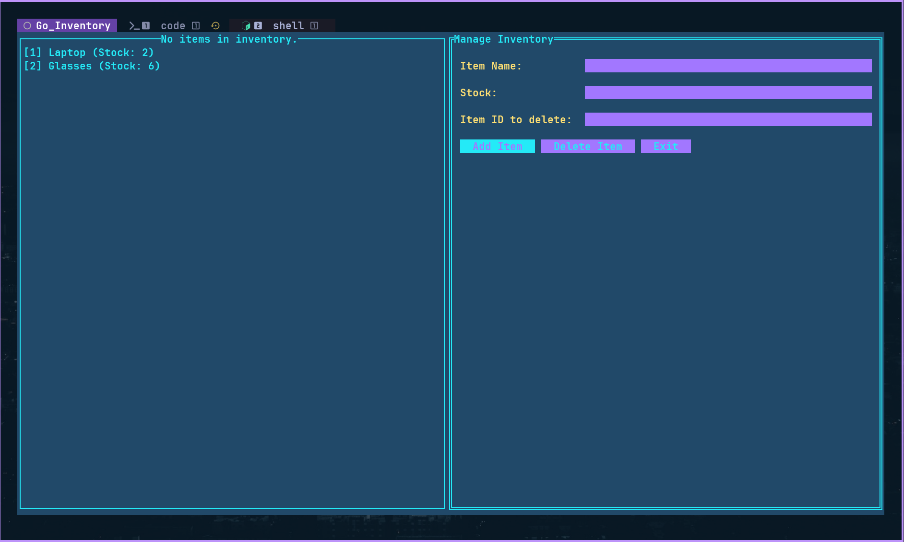

# Inventory Management System with Golang

This is a simple terminal-based Inventory Management System built with Golang and the [tview](https://github.com/rivo/tview) library. It allows you to manage an inventory of items, including adding new items and deleting existing ones.
